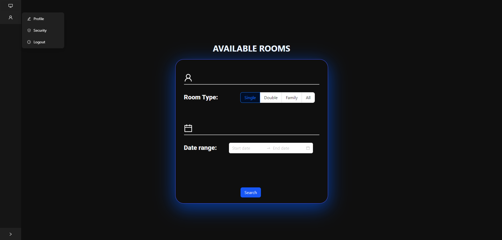
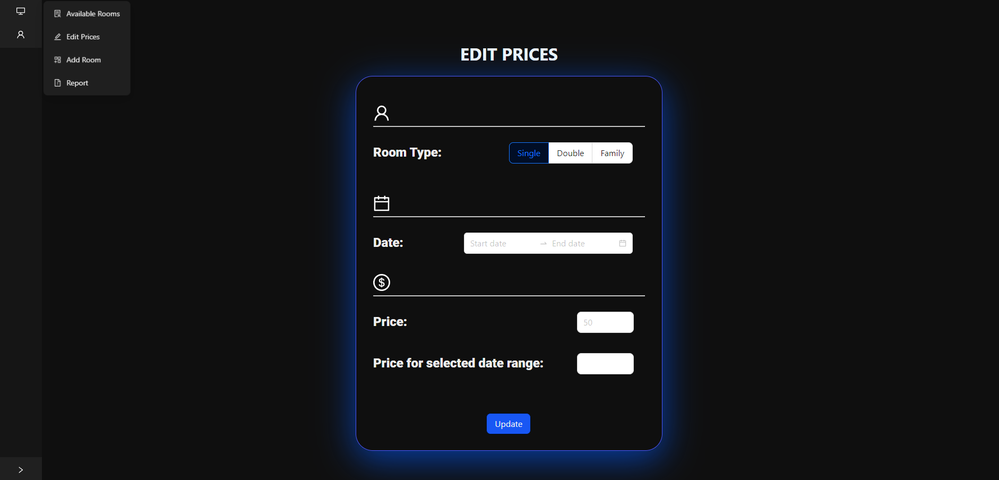
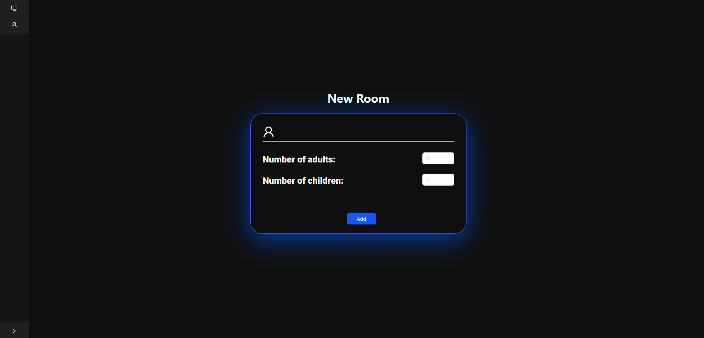
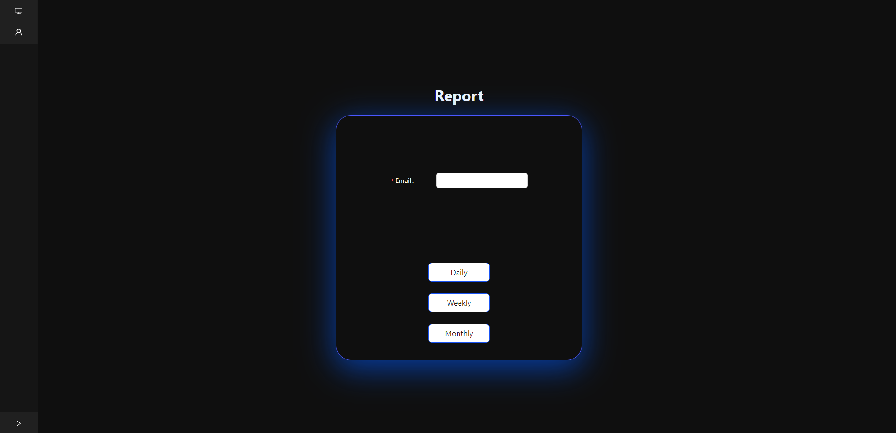

# Login Details
E-mail : someone@example.com
Password: admin135

# Hotel Management System

A robust hotel management system designed for hotel administrators to efficiently manage and oversee hotel operations. This application provides essential features for managing rooms, pricing, and bookings.

## Table of Contents
- [Description](#description)
- [Features](#features)
- [Installation](#installation)
- [Contributing](#contributing)
- [License](#license)
- [Acknowledgments](#acknowledgments)
- [Contact Information](#contact-information)
- [Images](#images)
- [Notes](#notes)

## Description
This Hotel Management System allows administrators to:
- Check room availability in real-time.
- Add new rooms with customizable features.
- Adjust room prices dynamically based on demand.


## Features
- **Room Management:** View, add, and edit room details.
- **Pricing Adjustment:** Modify room prices based on seasonality or promotions.
- **Booking Records:** Keep track of all customer bookings and transactions.
- **User Authentication:** Secure login for hotel administrators.


## Installation
1. Clone the repository:
   ```bash
   git clone https://github.com/Tugay72/Hotel-Management-System.git
2. Navigate to the project directory:
   ```bash
   cd Hotel-Management-System
3. Install dependencies (if applicable):
   ```bash
   npm install

## Contributing
Fork the repository.
Create a new branch (git checkout -b feature-branch).
Make your changes.
Commit your changes (git commit -m 'Add some feature').
Push to the branch (git push origin feature-branch).
Create a new Pull Request.


## License
This project is licensed under the Creative Commons NonCommercial (CC BY-NC) - see the LICENSE file for details.


## Acknowledgments
Ant Design for UI components.


## Contact Information
Project Link: https://github.com/Tugay72/Hotel-Management-System


## Images
 


 


 


 





## Notes:
- **Adjustments:** Modify the installation and usage instructions based on the actual setup for your project, especially if you're using a specific framework or technology stack.
- **Licensing and Acknowledgments:** Creative Commons NonCommercial (CC BY-NC)
- **Data**: Currently data is only available for the period 01/06/2024 - 15/09/2024

Feel free to let me know if you need any more modifications or additions!
